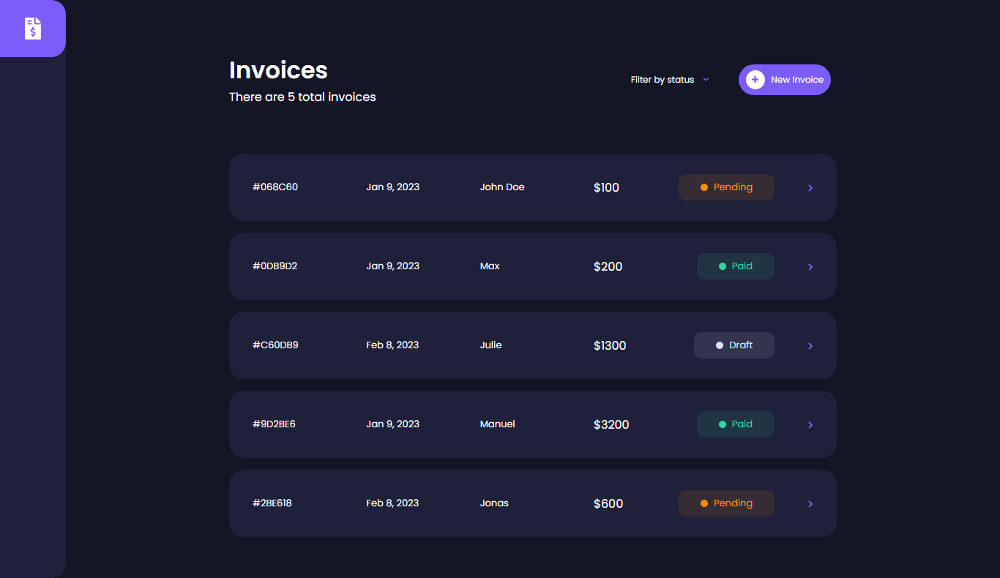
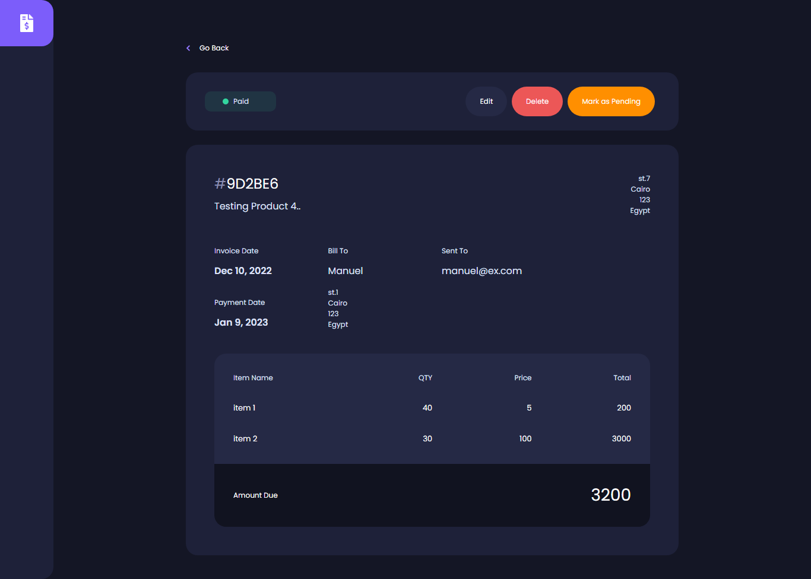
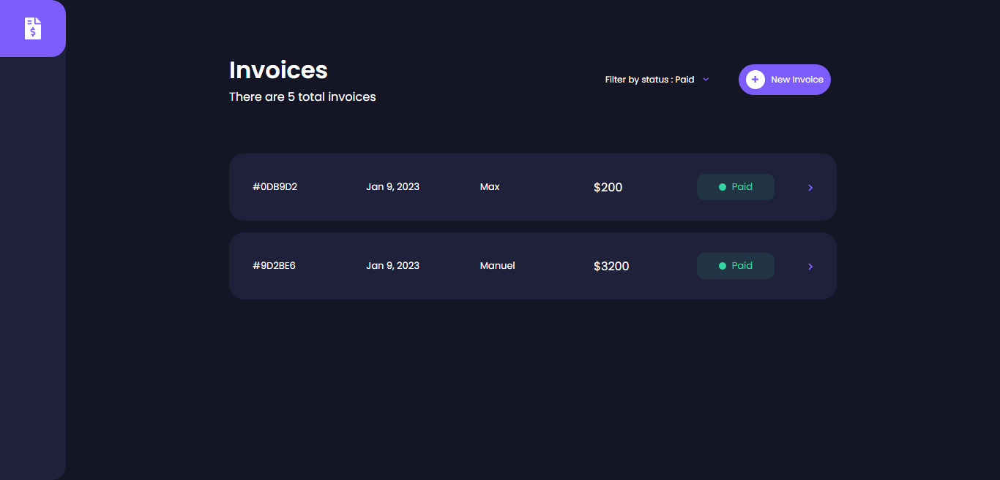
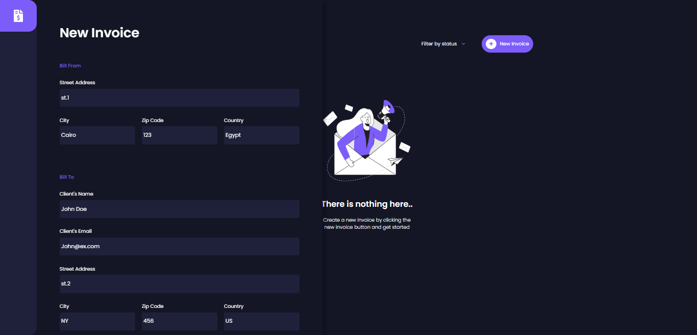
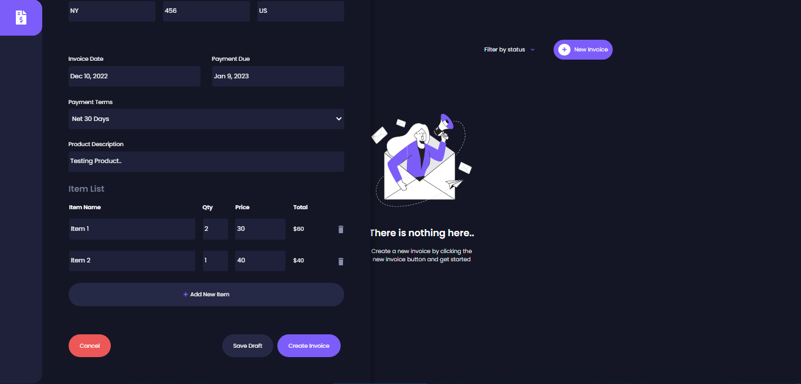
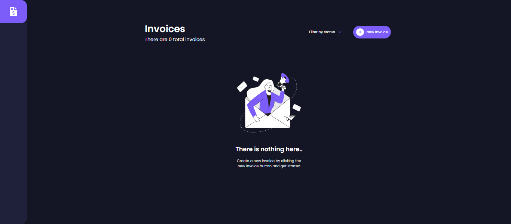

### Links

- Live Site URL: https://invoice-app-lake.vercel.app/

### Description

Users Can:

- View the optimal layout for the Invoices.
- Add new Invoice to the list.
- Mark Invoice as Paid, Pending or save as a draft.
- Delete Invoice from the list.
- Filter by all/draft/pending/paid Invoices.
- Edit Invoice Data.

### Screenshot

 
 
 

### Tools

- HTML
- SASS (SCSS)
- Vue 3 (incl: VueX, Router)
- Firebase (v. 9.14)
- UID Library
